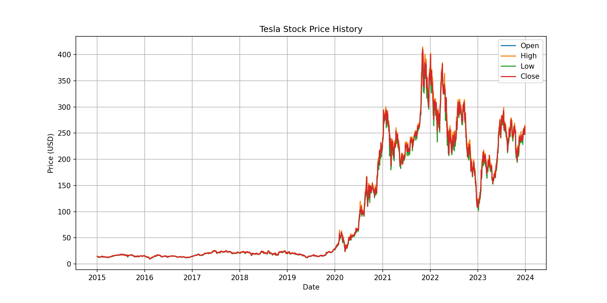
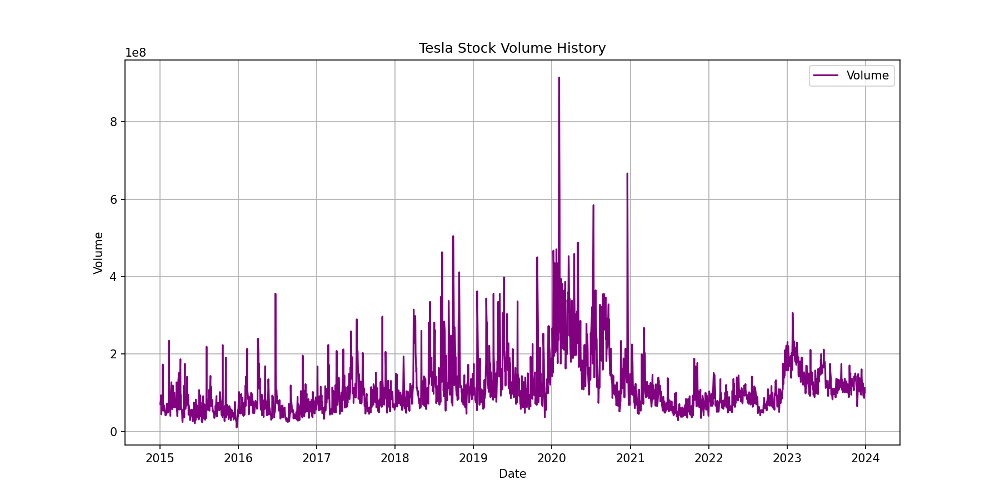
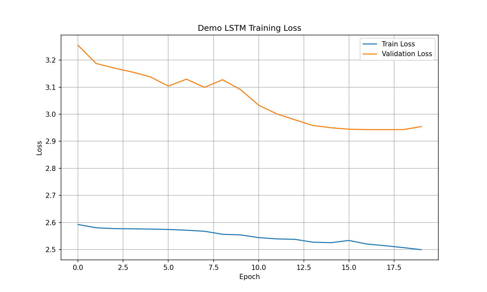
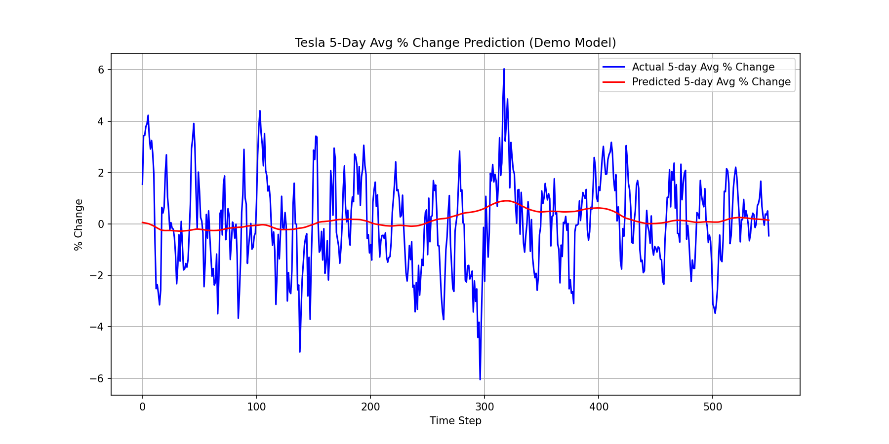

# Deep Learning Stock Prediction Project - Fundamentals of Data Science

## Table of Contents
- [Project Overview](#project-overview)
- [Problem Definition & Objectives](#problem-definition--objectives)
- [Exploratory Data Analysis (EDA)](#exploratory-data-analysis-eda)
- [Data Cleaning & Preprocessing](#data-cleaning--preprocessing)
- [Technical Difficulty & Depth](#technical-difficulty--depth)
- [Model Architecture](#model-architecture)
- [Results & Visualization](#results--visualization)
- [Code Quality & Reproducibility](#code-quality--reproducibility)
- [Presentation & Communication](#presentation--communication)
- [Installation & Usage](#installation--usage)
- [File Structure](#file-structure)
- [Results Directory](#results-directory)

## Project Overview

This project implements a deep learning solution for predicting Tesla stock price movements using Long Short-Term Memory (LSTM) networks. The system predicts the 5-day average percentage change in Tesla's stock price based on historical price data. The project includes two implementations:

1. **light_lstm_model.py** (Recommended): A streamlined version with a minimal LSTM model for demonstration and educational purposes
2. **main.py**: A more complex implementation with deeper LSTM architecture

**Note: Use `light_lstm_model.py` as the default implementation instead of main.py**

This project is part of the Fundamentals of Data Science (FDS) coursework, demonstrating comprehensive data science pipeline implementation.

## Problem Definition & Objectives

**Problem Definition:**
Predict Tesla's short-term stock trend by forecasting the 5-day average percentage change in stock price. This problem is particularly challenging due to the inherent volatility and noise in stock markets, which are influenced by numerous factors including market sentiment, economic indicators, and company-specific news.

**Objectives:**
- Implement a complete data science pipeline from data acquisition to model evaluation
- Apply LSTM neural networks to capture temporal dependencies in stock price movements
- Demonstrate proficiency in time series analysis and deep learning techniques
- Create a reproducible and well-documented solution suitable for academic evaluation
- Focus on data cleaning and preprocessing rather than achieving maximum predictive accuracy

## Exploratory Data Analysis (EDA)

The project includes comprehensive EDA to understand the characteristics of Tesla stock data:

### Data Sources
- **Source:** Yahoo Finance API via yfinance library
- **Time Period:** 2015-01-01 to 2024-01-01 (9 years of daily data)
- **Stock Symbol:** TSLA (Tesla Inc.)

### EDA Components
- **Summary Statistics:** Descriptive statistics saved to CSV for analysis
- **Price History Visualization:** Plot showing Open, High, Low, and Close prices over time
- **Volume History Visualization:** Plot showing trading volume trends
- **Data Quality Assessment:** Null value checks and data shape verification

### Key Insights from EDA
- Tesla stock shows significant volatility with periods of rapid growth and decline
- Trading volume often correlates with price movements
- Seasonal patterns and trends are observable over the 9-year period
- Data quality is high with minimal missing values

## Data Cleaning & Preprocessing

The preprocessing pipeline follows industry best practices for time series analysis:

### Feature Engineering
- **Daily Percentage Change:** Calculated as (Close price - Previous Close) / Previous Close * 100
- **Target Variable:** 5-day average percentage change, calculated using a rolling window and shifted forward
- **Input Features:** Normalized closing prices for LSTM input

### Data Transformation Steps
1. **Null Value Handling:** Removed rows with NaN values created by rolling window operations
2. **Normalization:** Applied MinMaxScaler to scale closing prices to [0,1] range
3. **Sequence Preparation:** Created sliding window sequences of 60 days (180 days in main.py) for LSTM input
4. **Train-Test Split:** 75% training, 25% testing with temporal order preserved

### Sequence Creation
- Input sequences: Previous 60 days of normalized closing prices
- Target: 5-day average percentage change (shifted forward to predict future values)
- Shape transformation: [samples, timesteps, features] for LSTM compatibility

## Technical Difficulty & Depth

**Level: Hard Topic (1.5 points)**

The project demonstrates advanced technical skills through:

### Deep Learning Implementation
- **Architecture:** LSTM networks for time series forecasting
- **Complexity:** Multi-layer LSTM with dropout regularization
- **Optimization:** Adam optimizer with mean squared error loss
- **Callbacks:** Early stopping to prevent overfitting

### Time Series Analysis
- **Temporal Dependencies:** Capturing long-term patterns in stock prices
- **Feature Engineering:** Creating predictive features from raw price data
- **Sequence Modeling:** Handling variable-length temporal sequences

### Advanced Data Processing
- **Normalization:** MinMaxScaler for feature scaling
- **Rolling Windows:** Complex time-based aggregations
- **Memory Management:** Efficient handling of large time series datasets

### Model Architecture Variants
- **Light Version:** Minimal LSTM (30 units) for demonstration
- **Main Version:** Deep LSTM (4 layers of 50 units each) with dropout

## Model Architecture

### Light LSTM Model (Recommended)
```python
model = Sequential()
model.add(LSTM(30, input_shape=(X_train.shape[1],1)))
model.add(Dense(1))
```

### Main LSTM Model
```python
model = Sequential()
model.add(LSTM(units=50, return_sequences=True, input_shape=(X_train.shape[1],1)))
model.add(Dropout(0.2))
model.add(LSTM(units=50, return_sequences=True))
model.add(Dropout(0.2))
model.add(LSTM(units=50, return_sequences=True))
model.add(Dropout(0.2))
model.add(LSTM(units=50))
model.add(Dropout(0.2))
model.add(Dense(1))
```

## Results & Visualization

The project generates multiple outputs for analysis:

### Generated Files
- **EDA Summary:** Descriptive statistics in CSV format
- **Price History Plot:** Visualizing stock price trends
- **Volume History Plot:** Showing trading volume patterns
- **Training Loss Plot:** Model convergence visualization
- **Prediction Plot:** Comparing actual vs predicted values
- **Predictions CSV:** Detailed prediction data

### Visual Outputs from Light LSTM Model

#### Tesla Stock Price History


#### Tesla Stock Volume History


#### Training Loss Visualization


#### 5-Day Average % Change Prediction


### Performance Metrics
- Training and validation loss curves
- Actual vs predicted value comparisons
- Model convergence analysis

### EDA Summary Statistics
The EDA summary provides key statistical measures of the Tesla stock data:

| Statistic | Close Price | High Price | Low Price | Open Price | Volume |
|-----------|-------------|------------|-----------|------------|--------|
| Count | 2264.0 | 2264.0 | 2264.0 | 2264.0 | 2264.0 |
| Mean | 102.89 | 105.19 | 100.46 | 102.91 | 114,258,043.20 |
| Std Dev | 110.94 | 113.52 | 108.29 | 111.04 | 77,047,741.24 |
| Min | 9.58 | 10.33 | 9.40 | 9.49 | 10,620,000.00 |
| Max | 409.97 | 414.50 | 405.67 | 411.47 | 914,082,000.00 |

This summary shows the high volatility of Tesla stock, with prices ranging from $9.58 to $409.97 over the 9-year period.

## Code Quality & Reproducibility

### Code Quality Features
- **Modular Design:** Clear separation of concerns with commented sections
- **Consistent Formatting:** Well-structured code with appropriate spacing
- **Error Handling:** Proper exception management for data acquisition
- **Documentation:** Comprehensive inline comments explaining each step

### Reproducibility Measures
- **Random Seeds:** Fixed numpy and TensorFlow seeds for consistent results
- **Parameter Configuration:** Clear variable definitions for easy modification
- **Environment Setup:** Complete dependency list in requirements.txt
- **Version Control:** Proper git tracking for code changes

### Best Practices Implemented
- **Separation of Concerns:** Each section has clear purpose and documentation
- **Memory Efficiency:** Proper data type handling and memory management
- **Scalability:** Configurable parameters for different use cases

## Installation & Usage

### Prerequisites
- Python 3.12 or higher
- Required packages listed in requirements.txt

### Setup
```bash
# Clone the repository
git clone <repository-url>

# Create virtual environment
python -m venv venv
source venv/bin/activate  # On Windows: venv\Scripts\activate

# Install dependencies
uv pip install -r requirements.txt
```

### Running the Project
```bash
# Recommended: Run the light LSTM model
uv run light_lstm_model.py

# Alternative: Run the main model (more complex)
uv run main.py
```

### Dependencies
- numpy
- pandas
- matplotlib
- yfinance
- scikit-learn
- keras
- tensorflow

## File Structure
```
deep-learning-stock-prediction/
├── light_lstm_model.py    # Recommended implementation
├── main.py               # Alternative implementation
├── requirements.txt      # Project dependencies
├── pyproject.toml        # Project configuration
├── uv.lock              # Dependency lock file
├── README.md            # This documentation
├── .gitignore           # Git ignore rules
├── .python-version      # Python version specification
└── results/             # Output directory
    ├── light-lstm/      # Light model results
    └── main/            # Main model results
```

## Results Directory

All outputs are saved in the `results/` directory:

### Light LSTM Results (`results/light-lstm/`)
- `eda_summary.csv` - Summary statistics from EDA
- `tsla_price_history.png` - Stock price visualization
- `tsla_volume_history.png` - Trading volume visualization
- `loss_plot.png` - Training and validation loss curves
- `tsla_5d_avg_prediction.png` - Actual vs predicted comparison
- `predictions.csv` - Detailed prediction data

### Main Model Results (`results/main/`)
- Similar structure with main model outputs

---

**Fundamentals of Data Science (FDS) Project**

This project was developed as part of the Fundamentals of Data Science coursework, demonstrating comprehensive implementation of a data science pipeline from data acquisition through model evaluation. The project showcases key skills in exploratory data analysis, data preprocessing, deep learning model development, and results visualization.

---
*by 0xkatana*